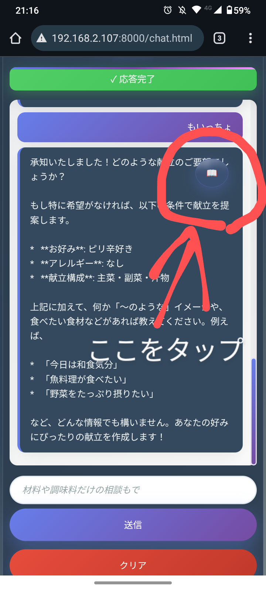
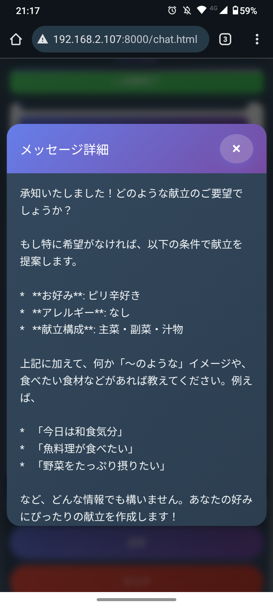

# 🤖 マルチエージェントSLMサーバー（統合AI専門アシスタント）
## 🎓 ポートフォリオ作品


**マルチエージェントSLMサーバー - ローカルSLM（Small Language Model）を活用した複数の専門AIアシスタント統合プラットフォーム**

LM StudioとローカルSLM（Small Language Model）を組み合わせ、**複数の専門AIアシスタント**を統合した、完全にプライベートな環境で利用できるマルチエージェントAIアシスタントプラットフォームです。

> ⚠️ **注意**: これはポートフォリオ・学習目的の作品です。個人利用を想定しており、商用利用は想定しておりません。

## 🎬 デモ動画

> **実際の動作を見てみましょう！** スマートフォンでの操作感やAIとの対話の様子をご覧いただけます。

<div align="center">
  <table>
    <tr>
      <td align="center">
        <a href="https://youtube.com/shorts/wMjhj4rWVgQ?feature=share">
          
          <br>
          <strong>📺 前半: マルチエージェント基本操作</strong>
        </a>
      </td>
      <td align="center">
        <a href="https://youtube.com/shorts/dFtQVlaKm0M?feature=share">
          
          <br>
          <strong>📺 後半: 専門アシスタント機能</strong>
        </a>
      </td>
    </tr>
  </table>
</div>

**🔥 動画で確認できるポイント:**
- ✨ マルチエージェント統合プラットフォーム
- 📱 統一されたスマートフォン最適化UI
- 🔧 分野別Function Calling実行状況の可視化
- 🔍 専門アシスタント別の特化機能
- 🤖 複数の専門AIとのシームレスな切り替え
- 🎨 統一されたデザインシステムと滑らかなアニメーション

> 📺 **YouTubeで視聴**:
> - 前半: [https://youtube.com/shorts/wMjhj4rWVgQ?feature=share](https://youtube.com/shorts/wMjhj4rWVgQ?feature=share)
> - 後半: [https://youtube.com/shorts/dFtQVlaKm0M?feature=share](https://youtube.com/shorts/dFtQVlaKm0M?feature=share)

## 📸 プロジェクトレジュメ

### 🌟 主要セールスポイント

| 特徴 | 詳細 | 技術的価値 |
|------|------|-----------|
| **🎯 マルチエージェント統合** | 料理・易占い・ロボ開発の専門AIを一つのプラットフォームで統合<br/>シームレスなアシスタント切り替えで様々な分野に対応 | 統合プラットフォーム設計による拡張性 |
| **🔧 分野別Function Calling** | 各AIが専門知識ベースと連携して動的データ取得<br/>具体的で実用的な情報を動的に取得・表示 | OpenAI Function Calling API準拠実装 |
| **🎨 統一UI/UXデザイン** | すべてのアシスタントで統一されたデザイン言語<br/>直感的なアシスタント選択画面と専門化されたUI | 一貫性のあるユーザーエクスペリエンス設計 |
| **📱 PWA対応統合環境** | 各アシスタントがPWA対応・オフライン利用可能<br/>ホーム画面に追加してネイティブアプリのような体験 | クロスプラットフォーム対応 |
| **🏠 完全ローカル運用** | LM Studio使用で使用制限・課金なし<br/>プライベート環境でデータ外部送信ゼロ | 自宅LLMによるコスト削減・プライバシー保護 |
| **⚡ リアルタイム応答** | ストリーミングAPI実装による高速応答<br/>Function Calling実行状況の可視化 | 高品質ユーザー体験の実現 |

### 📊 技術仕様

| 項目 | 仕様 | 特徴 |
|------|------|------|
| **AI エンジン** | ローカルSLM + LM Studio + マルチエージェント | 使用制限なし・完全プライベート・専門知識特化 |
| **アシスタント数** | 2つの稼働アシスタント + 1つ開発中 + 統合ハブ | 献立・易占い（稼働）・ロボ開発（開発中） |
| **Function Tools** | 各分野に特化したFunction Calling実装 | 動的データ取得・専門知識活用 |
| **対応デバイス** | スマートフォン・タブレット・PC | レスポンシブ完全対応 |
| **オフライン利用** | PWA完全対応（全アシスタント） | ネット接続不要で動作 |
| **起動速度** | 瞬時起動 | Service Worker キャッシュ活用 |
| **データプライバシー** | 100%ローカル処理 | 外部送信一切なし |

## 🎯 プロジェクト概要

LM StudioとローカルSLM（Small Language Model）を組み合わせ、**複数の専門AIアシスタント**を統合したマルチエージェントプラットフォームです。

**ローカルLLM + マルチエージェント設計**の実践例として、プライバシーを重視しながら専門性の高いAI技術を日常生活に取り入れる可能性を実証したプロジェクトです。

### 統合されたアシスタント

#### 🍳 献立アシスタント（レシピ特化）
- **専門分野**: 料理・レシピ・献立提案
- **Function Calling**: レシピ検索・詳細取得・お気に入り管理
- **知識ベース**: 30件の詳細レシピデータベース
- **特化機能**: 材料・カテゴリ検索・スコアリングシステム

#### ☯️ 易占いアシスタント（伝統占術特化）
- **専門分野**: 易学・五行思想・陰陽思想
- **Function Calling**: 六十四卦検索・詳細解釈・運勢分析
- **知識ベース**: 古代中国易学データベース
- **特化機能**: 卦象解釈・運勢診断・アドバイス提供

#### 🤖 ロボ開発アシスタント（開発中）
- **開発状況**: 現在開発中のため機能制限あり
- **予定機能**: ロボット開発・Arduino・センサー技術サポート

### 主な機能

- **🎯 統合アシスタント選択**: 美しいカード形式のアシスタント選択UI
- **🔧 分野別Function Calling**: 各分野に特化した動的データ取得機能
- **📱 統一PWA設計**: 全アシスタントで統一されたPWA体験
- **🏠 完全ローカル動作**: インターネット接続不要で全機能利用可能
- **⚡ リアルタイムストリーミング**: 高速応答とタイピング効果
- **🎨 レスポンシブデザイン**: スマートフォン・タブレット・PC完全対応

## 📱 アプリケーション画面（スマホでの表示例）

**実際のマルチエージェントアプリケーション画面**

<div align="center">
  <table>
    <tr>
      <td align="center">
        
        <br/><strong>🤖 マルチエージェント選択画面</strong>
        <br/>統合プラットフォームのメイン画面
      </td>
      <td align="center">
        
        <br/><strong>📖 詳細表示ボタン機能</strong>
        <br/>AIメッセージ右上の📖ボタン
      </td>
    </tr>
  </table>
</div>

<div align="center">
  <table>
    <tr>
      <td align="center">
        
        <br/><strong>🖼️ モーダル詳細表示</strong>
        <br/>美しいアニメーション付き別ウィンドウ
      </td>
      <td align="center">
        
        <br/><strong>⚡ リアルタイム応答画面</strong>
        <br/>ストリーミング対話とFunction Calling表示
      </td>
    </tr>
  </table>
</div>

### 📐 マルチエージェント画面の特徴

- **🎯 統合アシスタント選択**: 直感的なカード型UI・専門性が一目でわかるデザイン
- **🔧 分野別Function Calling可視化**: 実行中の関数とパラメータをリアルタイム表示
- **⚡ 統一ストリーミングレスポンス**: 全アシスタントでリアルタイム文字表示
- **👆 統一タッチ最適化**: スワイプでチャットクリア・長押し無効化
- **📖 統一詳細表示ボタン**: AIメッセージの右上ボタンで別ウィンドウ表示
- **🎨 統一プレミアムデザイン**: グラデーション・アニメーション・レスポンシブ対応
- **📱 統一PWAネイティブ体験**: インストール促進・オフライン対応・ホーム画面アイコン

## 🚀 使い方

### 1. ローカルサーバー起動
```bash
# プロジェクトフォルダへ移動
cd SLM_Server

# PythonのHTTPサーバーを起動（ポート8000）
python -m http.server 8000

# ブラウザでメイン画面にアクセス
# http://localhost:8000
```

### 2. アシスタント選択
1. メイン画面で使用したいアシスタントカードをクリック
2. 各アシスタントの専用チャット画面が開きます
3. PWAインストールで、ホーム画面からダイレクトアクセス可能

### 3. ホーム画面に追加（推奨）
1. スマホのブラウザでアプリを開く
2. 「インストール」ボタンが表示されたらタップ
3. 「ホーム画面に追加」を選択
4. これで各アシスタントにネイティブアプリのようにアクセス可能！

### 4. 各アシスタントでの対話例
- **献立アシスタント**: 「今日の夕食は何がいいかな？」「鶏肉を使ったレシピ教えて」
- **易占いアシスタント**: 「今日の運勢を占って」「仕事運について教えて」
- **ロボ開発アシスタント**: 開発中のため現在利用不可

## ✨ マルチエージェントでの利用機能

- **🎯 統合スマート入力システム**: 各アシスタントで最適化されたプレースホルダー
- **🔧 分野別Function Calling可視化**: 実行中の関数とパラメータをリアルタイム表示
- **⚡ 統一ストリーミング対話**: Server-Sent EventsによるリアルタイムAI応答
- **📱 統一PWA完全対応**: Service Worker・Manifest・インストール促進機能
- **🔄 統一自動最適化**: 画面回転対応・フォーカス時自動スクロール・タッチイベント最適化
- **📖 統一詳細表示機能**: AIメッセージ右上の📖ボタンで全文モーダル表示

## 🛠️ 技術構成の概要

### マルチエージェントシステム構成
```
🌐 統合ハブ (index.html + 統一スタイル)
        ↓
📱 各専門アシスタント (PWA + Function Calling)
  ├── 🍳 レシピアシスタント (recipe/chat.html)
  ├── ☯️ 易占いアシスタント (fortune/chat.html)
  └── 🤖 ロボ開発アシスタント (robotics/chat.html)
        ↓
🔧 分野別Function Calling Engine
        ↓
🔗 OpenAI互換API (/v1/chat/completions)
        ↓
🤖 LM Studio + ローカルSLM
```

### アーキテクチャ設計

#### 統合プラットフォーム設計
- **統一エントリーポイント**: index.htmlによる美しいアシスタント選択
- **分離された専門性**: 各アシスタントが独立したPWAとして動作
- **共通技術基盤**: 統一されたLM Studio API + Function Calling実装
- **スケーラブル設計**: 新しいアシスタントの追加が容易

#### 開発環境
- **フロントエンド**: バニラJS + PWA + マルチエージェント設計
- **AIエンジン**: LM Studio (設定は config.js で管理)
- **実行方法**: `python -m http.server 8000`
- **アクセス**: 各アシスタントに専用URL（localhost:8000/[assistant]/chat.html）

> 💡 **ポートフォリオ作品**: 技術検証・学習目的のため、詳細なセットアップ手順は省略しています。

## 🔧 Function Calling実装詳細

### 献立アシスタント（レシピ特化）

| 関数名 | 説明 | パラメータ |
|--------|------|-----------|
| **search_recipes** | 材料やキーワードでレシピを検索 | keyword, ingredients[], category |
| **get_recipe_detail** | レシピIDから詳細なレシピ情報を取得 | recipe_id |
| **get_user_favorites** | ユーザーのお気に入りレシピを取得 | なし |

**検索アルゴリズム**: スコアリングシステムにより最適な検索結果を提供
- 料理名マッチング: +20点、エイリアス: +25点、材料: +10点、特徴: +5点

### 易占いアシスタント（占術特化）

| 関数名 | 説明 | パラメータ |
|--------|------|-----------|
| **get_hexagram** | 六十四卦の詳細情報を取得 | hexagram_number |
| **search_fortune** | 運勢・相談内容による占い検索 | query, category |
| **get_daily_fortune** | 今日の総合運勢を取得 | date |

**占術システム**: 古代中国易学に基づく本格的な占い機能
- 六十四卦データベース、五行思想、陰陽理論の統合

### ロボ開発アシスタント（開発中）

**開発状況**: 現在機能開発中
- Arduino・センサー・ロボット工学分野への対応を予定

## 📱 PWA機能（全アシスタント統一）

- **🏠 ホーム画面統合**: ワンタップインストール・カスタムアイコン・スプラッシュ画面
- **🔄 オフライン完全対応**: Service Worker実装・キャッシュ戦略・ネットワーク状態検知
- **📱 ネイティブ体験**: standalone表示・ステータスバー統合・画面方向制御
- **⚡ 自動アップデート**: バックグラウンド更新・変更検知・シームレス適用
- **🎯 プラットフォーム最適化**: Android Chrome対応確認済み（iOS未検証）

## 🎨 統合プラットフォームの特徴

- **🎯 マルチエージェント設計**: 専門性の高い複数AIの統合運用
- **🔧 分野別Function Calling**: 各分野に最適化された動的データ取得
- **⚡ 統一ストリーミング**: 全アシスタントでリアルタイム応答
- **👆 統一モバイル設計**: 全アシスタントで統一されたタッチ最適化
- **🤖 専門AI連携**: 分野別システムプロンプト・専門知識ベース活用
- **🔒 完全プライベート**: ローカル環境完結・データ外部送信なし

## 🔧 技術構成 & ローカルLLM活用

### ローカルLLM環境
- **LM Studio API Server** - IPアドレスは config.js で設定（デフォルト: http://192.168.2.109:1234）
- **マルチエージェント実装** - 分野別システムプロンプト・専門知識ベース
- **Function Calling実装** - OpenAI互換Function Calling API準拠
- **OpenAI互換API** - /v1/chat/completions エンドポイントで全アシスタント対応

### フロントエンド技術スタック
- **バニラJavaScript** - フレームワーク依存なし・軽量実装
- **マルチエージェント設計** - 統合プラットフォーム・分離された専門性
- **統一Function Calling Engine** - 分野別ローカル関数実行・結果可視化
- **CSS3 Advanced** - グラデーション・アニメーション・レスポンシブ
- **PWA Core** - Service Worker + Web App Manifest + インストール促進

### システムアーキテクチャ
```
index.html (統合ハブ) ←→ [assistant]/chat.html (専門UI)
         ↓                        ↓
統合スタイル設計         script.js (Function Calling + ストリーミング処理)
         ↓                        ↓
アシスタント選択UI       分野別Function Tools ←→ LM Studio API
```

### ローカルLLM活用のメリット
- **プライバシー保護**: 各分野の専門的な相談内容が外部に送信されない
- **オフライン利用**: インターネット接続不要で全アシスタント利用可能
- **カスタマイズ性**: 分野別システムプロンプトで専門性を強化
- **コスト効率**: API利用料金不要でSLMを自由に活用
- **マルチエージェント**: 複数の専門AIを統合した効率的な知識活用

## 🌟 実装されたマルチエージェント機能

- **🎯 統合アシスタント選択**: 美しいカード型UI・直感的なナビゲーション
- **🔧 分野別Function Calling**: 各専門分野に最適化された動的データ取得
- **👆 統一ジェスチャー操作**: 全アシスタントで統一されたスワイプ・タッチ操作
- **⚡ 統一ストリーミング**: 全アシスタントでリアルタイム応答・タイピング効果
- **📱 統一PWA体験**: 全アシスタントでインストール・オフライン対応
- **📖 統一詳細表示**: AIメッセージ詳細表示・美しいモーダルアニメーション

## 💡 ローカルLLM(SLM) + マルチエージェント活用で学んだこと

### 🤖 マルチエージェントシステム設計
- **専門性の分離**: 各分野に特化したアシスタント設計・知識ベース構築
- **統合プラットフォーム**: 統一UI/UXでの複数AI統合・シームレスな切り替え
- **Function Calling最適化**: 分野別に最適化された動的データ取得システム
- **スケーラブル設計**: 新しいアシスタントの追加が容易な拡張可能アーキテクチャ

### 🏠 ローカルAI環境の高度活用
- **LM Studio統合運用**: 複数アシスタントでの効率的なAPI活用
- **分野別最適化**: 各専門分野に合わせたシステムプロンプト・パラメータ調整
- **統一エラーハンドリング**: 全アシスタントで一貫したエラー処理・フォールバック
- **パフォーマンス最適化**: 統合環境でのリソース効率化・応答速度向上

### 📱 実用的なマルチアプリケーション開発
- **統一PWA実装**: 全アシスタントでの一貫したPWA体験・インストール対応
- **マルチモーダルUX**: 分野別に最適化されたUI・統一されたデザイン言語
- **クロスプラットフォーム**: 全アシスタントでのレスポンシブ対応・デバイス最適化
- **統合プラットフォーム管理**: 複数アプリケーションの効率的な管理・更新システム

### 🎯 プロジェクトの意義
- **マルチエージェントAIの実証**: 複数の専門AIを統合した実用的なプラットフォーム例
- **プライバシー重視統合**: 個人データを外部に送信しない安全なマルチAI活用
- **学習成果**: ローカルLLM環境から実用的なマルチエージェント統合までの習得
- **統合プラットフォーム構築**: 拡張可能で保守性の高いマルチアプリケーション設計

## 🚀 今後の展開可能性

### 🎭 新しいアシスタントの追加

現在のマルチエージェント設計をベースに、**さらなる専門アシスタント**の追加が容易です：

| 追加可能なアシスタント | 知識ベース | Function Tools | 専門分野 |
|----------|------------|----------------|------|
| **📚 学習アシスタント** | `study-materials.json` | search_lessons, get_quiz, get_progress | 教育・学習支援 |
| **🏥 健康アドバイザー** | `health-info.json` | search_symptoms, get_treatment, get_advice | 健康・医療情報 |
| **🌱 ガーデニング助手** | `plants.json` | search_plants, get_care_guide, get_calendar | 植物・園芸 |
| **🎮 ゲーム攻略助手** | `game-guides.json` | search_guides, get_walkthrough, get_tips | ゲーム攻略 |
| **📖 読書アシスタント** | `books.json` | search_books, get_summary, get_recommendations | 書籍・読書 |
| **💼 ビジネス助手** | `business-info.json` | search_templates, get_analysis, get_advice | ビジネス・業務 |

**実装方法**:
- 統一アーキテクチャによる新アシスタント追加
- 分野別Function Tools自動生成
- 統一UI/UXテンプレートの活用
- 段階的な知識ベース拡張（100件→1,000件→10,000件）

### 🤖 エッジデバイス・IoT統合の可能性

このプロジェクトで実証した**マルチエージェント + ローカルLLM技術**は、以下のような展開が考えられます：

- **🏠 スマートホーム統合**: Raspberry Pi等での軽量SLM + マルチエージェント動作
- **🤖 ロボット統合システム**: 音声対話による複数専門アシスタント機能 + 動的データ取得
- **📱 エッジコンピューティング**: オフライン環境での高速マルチエージェント応答
- **🔒 企業内プライベートAI**: データ外部送信なしの安全なマルチエージェント活用

**技術基盤**: 本プロジェクトのマルチエージェント設計により、様々なデバイスへの統合展開が容易になっています。

### 🌐 クラウド・ハイブリッド展開

- **クラウドベース統合**: AWS・Azure等でのマルチエージェント展開
- **ハイブリッド環境**: ローカル + クラウドの最適な組み合わせ
- **API Gateway統合**: 複数のAIサービスとの連携・フォールバック
- **マイクロサービス化**: 各アシスタントの独立サービス化・コンテナ展開

## 📄 ライセンス・利用について

**ポートフォリオ・学習目的の作品**

このプロジェクトは技術学習・ポートフォリオ展示のために制作されたものです。
ソースコード閲覧・技術参考は自由ですが、商用利用は想定しておりません。

## 🔧 開発環境・ツール

このプロジェクトの開発には以下のツールを使用しました：

- **LM Studio**: ローカルLLM実行環境
- **開発ツール**: Claude Code, Cursor
- **AI支援機能**: コード生成・リファクタリング・マルチエージェント設計・Function Calling実装

---

## 📋 開発情報

| 開発者 | tomomo086 + Claude |
|--------|-------------------|
| 開発期間 | 2025年9月 |
| バージョン | 1.0.0 (マルチエージェント統合版) |
| 開発ツール | Claude Code, Cursor, LM Studio |
| 主要機能 | マルチエージェント統合, Function Calling, PWA |

## 🔗 関連リンク

- [tomomo086: Github](https://github.com/tomomo086)
- [@mirai_sousiyo39: X](https://x.com/mirai_sousiyo39)

---

**作成者**: [tomomo086(@mirai_sousiyo39) + Claude]
**最終更新**: 2025年9月

🤖 **AI駆動開発の実践例**

このREADMEもClaudeによるAI支援で作成されています。
本プロジェクトは、ローカルLLM + マルチエージェント設計とPWA技術を組み合わせた実践として制作した作品です。

---

複数の専門AIアシスタントで、あなたの様々なニーズにお応えします！🤖✨