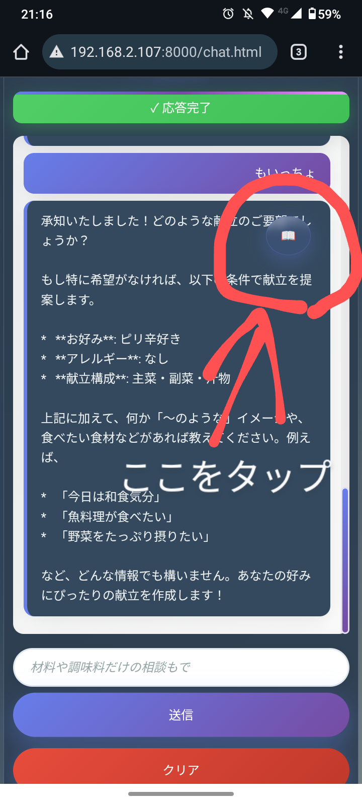
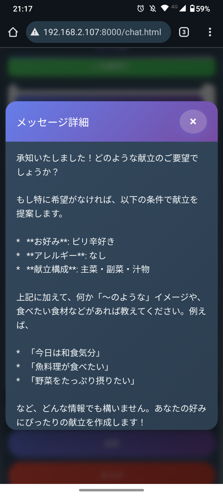

# 🍽️ ポケット献立アシスタント（Function Calling版）
## 🎓 ポートフォリオ作品


**ポケット献立アシスタント - ローカルSLM（Small Language Model）を活用した献立提案PWAアプリケーション（Function Calling実装版）**

LM StudioとローカルSLM（Small Language Model）を組み合わせ、**Function Calling機能**により具体的なレシピ検索・詳細表示が可能な、完全にプライベートな環境でスマートフォンからも献立の相談ができるポケット献立アシスタントです。

> ⚠️ **注意**: これはポートフォリオ・学習目的の作品です。個人利用を想定しており、商用利用は想定しておりません。

## 🎬 デモ動画

> **実際の動作を見てみましょう！** スマートフォンでの操作感やAIとの対話の様子をご覧いただけます。

<div align="center">
  <table>
    <tr>
      <td align="center">
        <a href="https://youtube.com/shorts/wMjhj4rWVgQ?feature=share">
          
          <br>
          <strong>📺 前半: 基本操作デモ</strong>
        </a>
      </td>
      <td align="center">
        <a href="https://youtube.com/shorts/dFtQVlaKm0M?feature=share">
          
          <br>
          <strong>📺 後半: 詳細機能デモ</strong>
        </a>
      </td>
    </tr>
  </table>
</div>

**🔥 動画で確認できるポイント:**
- ✨ リアルタイム文字ストリーミング応答
- 📱 スマートフォン専用最適化UI
- 🔧 Function Calling実行状況の可視化
- 🔍 具体的なレシピ検索・詳細表示機能
- 🤖 専門的な料理アドバイスと詳細レシピ
- 🎨 グラデーションデザインと滑らかなアニメーション

> 📺 **YouTubeで視聴**: 
> - 前半: [https://youtube.com/shorts/wMjhj4rWVgQ?feature=share](https://youtube.com/shorts/wMjhj4rWVgQ?feature=share)
> - 後半: [https://youtube.com/shorts/dFtQVlaKm0M?feature=share](https://youtube.com/shorts/dFtQVlaKm0M?feature=share)

## 📸 プロジェクトレジュメ

### 🌟 主要セールスポイント

| 特徴 | 詳細 | 技術的価値 |
|------|------|-----------|
| **🔧 Function Calling実装** | AIが自動でレシピ検索・詳細取得関数を実行<br/>具体的なレシピ情報を動的に取得・表示 | OpenAI Function Calling API準拠実装 |
| **🤖 インテリジェント検索** | 材料・キーワード・カテゴリによる高度なレシピ検索<br/>スコアリングシステムによる最適な結果表示 | アルゴリズム最適化による検索精度向上 |
| **📱 初心者フレンドリーUI** | ウェルカムメッセージで使い方を直感的に説明<br/>入力欄のガイドメッセージで迷わず操作可能 | UXデザインによるAI普及促進 |
| **💬 大画面チャット設計** | レスポンシブ対応でどのデバイスでも見やすく<br/>チャット欄を大きく取り会話に集中できる設計 | モバイルファーストUI設計 |
| **🏠 完全ローカル運用** | LM Studio使用で使用制限・課金なし<br/>プライベート環境でデータ外部送信ゼロ | 自宅LLMによるコスト削減 |
| **⚡ リアルタイム応答** | Function Calling実行状況の可視化<br/>AI応答のタイピング効果によるスムーズな対話体験 | 高品質ユーザー体験の実現 |

### 📊 技術仕様

| 項目 | 仕様 | 特徴 |
|------|------|------|
| **AI エンジン** | ローカルSLM + LM Studio + Function Calling | 使用制限なし・完全プライベート・動的データ取得 |
| **Function Tools** | search_recipes, get_recipe_detail, get_user_favorites | OpenAI互換Function Calling API実装 |
| **レシピデータ** | 30件の詳細レシピデータベース | JSON形式・検索最適化済み |
| **対応デバイス** | スマートフォン・タブレット・PC | レスポンシブ完全対応 |
| **オフライン利用** | PWA完全対応 | ネット接続不要で動作 |
| **起動速度** | 瞬時起動 | Service Worker キャッシュ活用 |
| **データプライバシー** | 100%ローカル処理 | 外部送信一切なし |

## 🎯 プロジェクト概要

LM StudioとローカルSLM（Small Language Model）を組み合わせ、**Function Calling機能**を実装した完全プライベートなポケット献立アシスタントです。

**ローカルLLM + Function Calling活用**の実践例として、プライバシーを重視しながらAI技術を日常生活に取り入れる可能性を実証したプロジェクトです。

### 主な機能
- **🔧 Function Calling**: AIが自動でレシピ検索・詳細取得関数を実行
- **🔍 インテリジェント検索**: 材料・キーワード・カテゴリによる高度なレシピ検索
- **📊 スコアリングシステム**: 検索結果の関連度を数値化して最適な順序で表示
- **📱 スマートフォン最適化**: タッチ操作・スワイプ機能・レスポンシブデザイン
- **🏠 PWA対応**: ホーム画面追加・オフライン動作・ネイティブアプリ体験
- **📚 豊富なレシピデータ**: 30件の詳細レシピデータベース内蔵

## 📱 アプリケーション画面（スマホでの表示例）

**実際のアプリケーション画面**

<div align="center">
  <table>
    <tr>
      <td align="center">
        
        <br/><strong>📖 詳細表示ボタン機能</strong>
        <br/>AIメッセージ右上の📖ボタン
      </td>
      <td align="center">
        
        <br/><strong>🖼️ モーダル詳細表示</strong>
        <br/>美しいアニメーション付き別ウィンドウ
      </td>
    </tr>
  </table>
</div>

### 📐 アプリケーション画面の特徴

- **🎯 インテリジェント入力**: タイピングアニメーション付きプレースホルダー
- **🔧 Function Calling可視化**: 実行中の関数とパラメータをリアルタイム表示
- **⚡ ストリーミングレスポンス**: リアルタイム文字表示によるスムーズな対話
- **👆 タッチ最適化**: スワイプでチャットクリア・長押し無効化
- **📖 詳細表示ボタン**: AIメッセージの右上ボタンで別ウィンドウ表示
- **🎨 プレミアムデザイン**: グラデーション・アニメーション・レスポンシブ対応
- **📱 PWAネイティブ体験**: インストール促進・オフライン対応・ホーム画面アイコン

## 🚀 スマホでの使い方

### 1. ホーム画面に追加（推奨）
1. スマホのブラウザでアプリを開く
2. 「インストール」ボタンが表示されたらタップ
3. 「ホーム画面に追加」を選択
4. これでネイティブアプリのように使えます！

### 2. ブラウザから直接使用
- スマホのブラウザで直接アクセス
- レスポンシブデザインで画面サイズに対応
- チャット形式で直感的な操作

## ✨ スマートフォンでの利用機能

- **🎯 スマート入力システム**: 5種類のローテーション・プレースホルダー自動切り替え
- **🔧 Function Calling可視化**: 実行中の関数とパラメータをリアルタイム表示
- **⚡ ストリーミング対話**: Server-Sent EventsによるリアルタイムAI応答
- **📱 PWA完全対応**: Service Worker・Manifest・インストール促進機能
- **🔄 自動最適化**: 画面回転対応・フォーカス時自動スクロール・タッチイベント最適化
- **📖 詳細表示機能**: AIメッセージ右上の📖ボタンで全文モーダル表示・テキスト選択機能との両立

## 🛠️ 技術構成の概要

### システム構成
```
📱 PWAフロントエンド (chat.html + script.js + styles.css)
           ↓
🔧 Function Calling Engine (search_recipes, get_recipe_detail, get_user_favorites)
           ↓
🔗 OpenAI互換API (/v1/chat/completions)
           ↓
🤖 LM Studio + ローカルSLM
```

### 開発環境
- **フロントエンド**: バニラJS + PWA + Function Calling
- **AIエンジン**: LM Studio (http://192.168.2.107:1234)
- **実行方法**: `python -m http.server 8000`

> 💡 **ポートフォリオ作品**: 技術検証・学習目的のため、詳細なセットアップ手順は省略しています。

## 🔧 Function Calling実装詳細

### 利用可能な関数

| 関数名 | 説明 | パラメータ |
|--------|------|-----------|
| **search_recipes** | 材料やキーワードでレシピを検索 | keyword, ingredients[], category |
| **get_recipe_detail** | レシピIDから詳細なレシピ情報を取得 | recipe_id |
| **get_user_favorites** | ユーザーのお気に入りレシピ（いつものレシピ）を取得 | なし |

### 検索アルゴリズム

**スコアリングシステム**により最適な検索結果を提供：

- **料理名マッチング**: 各単語について+20点
- **エイリアス（別名）マッチング**: +25点×個数
- **材料マッチング**: +10点×個数
- **特徴マッチング**: +5点×個数
- **メイン材料マッチング**: 各単語について+15点
- **カテゴリマッチング**: +10点

### レシピデータ構造

```json
{
  "id": "recipe_001",
  "title": "しょうが焼き",
  "aliases": ["生姜焼き", "豚の生姜焼き", "豚のしょうが焼き", "ジンジャーポーク"],
  "cooking_time": "10分",
  "ingredients": ["豚ロース 300g", "生姜チューブ 4cm", ...],
  "steps": ["肉を焼く", "混ぜたタレを加え、強火で煮詰める"],
  "main_ingredients": ["豚肉", "豚ロース"],
  "categories": ["teiban", "meat"],
  "features": ["10分", "2ステップ", "失敗しない"],
  "tips": "終始強火。タレは事前混合。ほぼ無くなるまで煮詰める。",
  "substitutions": "豚こまOK。柔らかくしたいなら小麦粉をまぶし弱火で。"
}
```

## 📱 PWA機能

- **🏠 ホーム画面統合**: ワンタップインストール・カスタムアイコン・スプラッシュ画面
- **🔄 オフライン完全対応**: Service Worker実装・キャッシュ戦略・ネットワーク状態検知
- **📱 ネイティブ体験**: standalone表示・ステータスバー統合・画面方向制御
- **⚡ 自動アップデート**: バックグラウンド更新・変更検知・シームレス適用
- **🎯 プラットフォーム最適化**: Android Chrome対応確認済み（iOS未検証）

## 🎨 アプリケーションの特徴

- **🎯 インテリジェントUI**: プレースホルダー自動切り替え・スマート入力システム
- **🔧 Function Calling可視化**: 実行中の関数とパラメータをリアルタイム表示
- **⚡ リアルタイム応答**: ストリーミングAI応答・文字単位でのライブ表示
- **👆 モバイル特化設計**: タッチ最適化・ジェスチャー操作・画面サイズ適応
- **🤖 専門AI連携**: 料理特化システムプロンプト・個人化レシピ提案
- **🔒 完全プライベート**: ローカル環境完結・データ外部送信なし

## 🔧 技術構成 & ローカルLLM活用

### ローカルLLM環境
- **LM Studio API Server** - http://192.168.2.107:1234 でローカルSLM実行
- **Function Calling実装** - OpenAI互換Function Calling API準拠
- **料理特化プロンプト** - 豊富なレシピデータベース内蔵（30件の詳細レシピ）
- **OpenAI互換API** - /v1/chat/completions エンドポイントでFunction Calling対応

### フロントエンド技術スタック
- **バニラJavaScript** - フレームワーク依存なし・軽量実装
- **Function Calling Engine** - ローカル関数実行・結果可視化
- **CSS3 Advanced** - グラデーション・アニメーション・レスポンシブ
- **PWA Core** - Service Worker + Web App Manifest + インストール促進

### システムアーキテクチャ
```
chat.html (UI) ←→ script.js (Function Calling + ストリーミング処理) ←→ LM Studio API
      ↓                    ↓
 sw.js (キャッシュ)    fetch API (リアルタイム通信 + Function Calling)
```

### ローカルLLM活用のメリット
- **プライバシー保護**: 食事の好みや健康情報が外部に送信されない
- **オフライン利用**: インターネット接続不要で献立相談可能
- **カスタマイズ性**: システムプロンプトで日本の食文化に特化
- **コスト効率**: API利用料金不要でSLMを自由に活用
- **Function Calling**: 動的なデータ取得による具体的なレシピ情報提供

## 🌟 実装されたスマートフォン機能

- **🎯 5段階プレースホルダー**: 自動ローテーション・タイピングアニメーション
- **🔧 Function Calling可視化**: 実行中の関数とパラメータをリアルタイム表示
- **👆 ジェスチャー操作**: 右スワイプでチャットクリア・ピンチズーム防止
- **⚡ フォーカス最適化**: 入力時自動スクロール・キーボード表示対応
- **📱 PWAインストール**: beforeinstallprompt イベント・カスタムUI表示
- **📖 メッセージ詳細表示**: AIメッセージ右上📖ボタン・美しいモーダルアニメーション・テキスト選択との競合回避

## 💡 ローカルLLM(SLM) + Function Calling活用で学んだこと

### 🤖 SLM（Small Language Model）の実用化
- **ドメイン特化プロンプト**: 料理研究家ペルソナ・豊富なレシピデータベース活用
- **Function Calling実装**: OpenAI互換API準拠・動的データ取得システム
- **ストリーミングAPI実装**: Server-Sent Events・リアルタイム文字表示
- **個人化システム**: 「いつも」キーワードによる学習済みレシピ優先提案

### 🏠 ローカルAI環境の構築経験
- **LM Studio API連携**: http://192.168.2.107:1234・OpenAI互換エンドポイント
- **Function Calling実装**: ローカル関数実行・結果可視化・エラーハンドリング
- **エラーハンドリング実装**: 接続失敗・ストリーミング中断・JSONパースエラー対応
- **パフォーマンス最適化**: temperature: 0.7・ストリーミング有効化

### 📱 実用的なWebアプリケーション開発
- **PWA完全実装**: Service Worker・Web App Manifest・beforeinstallprompt
- **モバイルUX特化**: タッチイベント・ジェスチャー・viewport最適化
- **バニラJS実装**: フレームワーク依存なし・軽量・高速動作
- **Function Calling可視化**: 実行状況のリアルタイム表示・ユーザビリティ向上

### 🎯 プロジェクトの意義
- **ローカルAIの実証**: SLM + Function Callingを活用した実用的なアプリケーション例
- **プライバシー保護**: 個人データを外部に送信しない安全なAI活用
- **学習成果**: ローカルLLM環境の構築から実用化までの一連の流れを習得
- **Function Calling実装**: OpenAI互換API準拠の動的データ取得システム構築

## 🚀 今後の展開可能性

### 🎭 ペルソナ・知識ベース切り替えシステム

現在のFunction Calling実装をベースに、**複数の専門アシスタント**への拡張が可能です：

| ペルソナ | 知識ベース | Function Tools | 用途 |
|----------|------------|----------------|------|
| **🍽️ ポケット献立アシスタント** | `recipes.json` | search_recipes, get_recipe_detail | 料理・レシピ |
| **📚 学習アシスタント** | `study-materials.json` | search_lessons, get_quiz | 教育・学習 |
| **🏥 健康アドバイザー** | `health-info.json` | search_symptoms, get_treatment | 健康・医療 |
| **🌱 ガーデニング助手** | `plants.json` | search_plants, get_care_guide | 植物・園芸 |
| **🎮 ゲーム攻略助手** | `game-guides.json` | search_guides, get_walkthrough | ゲーム攻略 |
| **📖 読書アシスタント** | `books.json` | search_books, get_summary | 書籍・読書 |

**実装方法**:
- 設定ファイルによるペルソナ切り替え
- 動的Function Tools生成
- 統一されたデータ構造
- 段階的な知識ベース拡張（100件→1,000件→10,000件）

### 🤖 エッジデバイス・ロボット応用の可能性

このプロジェクトで実証した**ローカルLLM + Function Calling技術**は、以下のような展開が考えられます：

- **🏠 スマートデバイス統合**: Raspberry Pi等での軽量SLM + Function Calling動作
- **🤖 ロボット搭載**: 音声対話による料理アシスタント機能 + 動的データ取得
- **📱 エッジコンピューティング**: オフライン環境での高速応答 + ローカルデータベース活用
- **🔒 プライバシー重視**: データ外部送信なしの安全なAI活用 + Function Calling

**技術基盤**: 本プロジェクトのOpenAI互換API + Function Calling設計により、様々なデバイスへの移植が容易になっています。

## 📄 ライセンス・利用について

**ポートフォリオ・学習目的の作品**

このプロジェクトは技術学習・ポートフォリオ展示のために制作されたものです。  
ソースコード閲覧・技術参考は自由ですが、商用利用は想定しておりません。

## 🔧 開発環境・ツール

このプロジェクトの開発には以下のツールを使用しました：

- **LM Studio**: ローカルLLM実行環境
- **開発ツール**: VS Code, Claude Code
- **AI支援機能**: コード生成・リファクタリング・Function Calling実装

---

## 📋 開発情報

| 開発者 | tomomo086 + Claude |
|--------|-------------------|
| 開発期間 | 2025年9月 |
| バージョン | 2.0.0 (Function Calling版) |
| 開発ツール | Claude Code, LM Studio |
| 主要機能 | Function Calling, レシピ検索, PWA |

## 🔗 関連リンク

- [tomomo086: Github](https://github.com/tomomo086)
- [@mirai_sousiyo39: X](https://x.com/mirai_sousiyo39)

---

**作成者**: [tomomo086(@mirai_sousiyo39) + Claude]  
**最終更新**: 2025年1月

🤖 **AI駆動開発の実践例**

このREADMEもClaudeによるAI支援で作成されています。  
本プロジェクトは、ローカルLLM + Function CallingとPWA技術を組み合わせた実践として制作した作品です。

---

スマホで快適に献立を考えましょう！🍽️✨